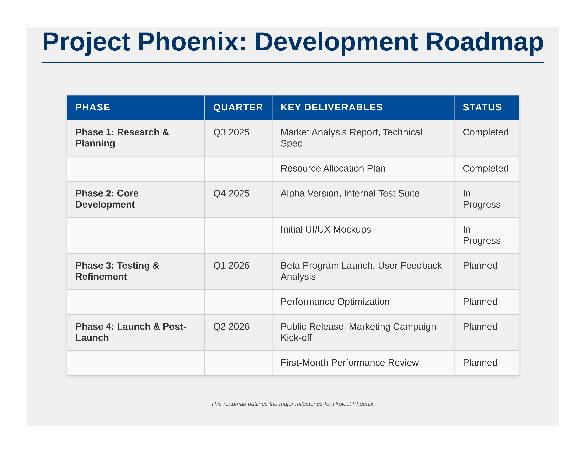

# `hierarchy-table` Plugin
<div align="center">
  <table>
    <tr>
      <td align="center">
        
        <br><strong>Hierarchy Table Sample</strong>
      </td>
    </tr>
  </table>
</div>

This plugin transforms a Markdown file containing a table (and optionally a title) into a PDF formatted as a presentation slide. It's ideal for sharing structured information like organizational charts, feature comparisons, or project hierarchies.

## Creating This Plugin: A Developer's Trace

This plugin was developed to showcase how `oshea` can be extended for specific presentation needs. Here's a conceptual trace of its creation:

1.  **Initialization (Conceptual `plugin create`):**
    The plugin structure was started (conceptually) using:
    ```bash
    # From within the main oshea repository:
    # oshea plugin create hierarchy-table --dir ../oshea-plugins
    ```
    This command (if run) would generate boilerplate files:
    * `hierarchy-table/default.yaml`
    * `hierarchy-table/index.js`
    * `hierarchy-table/style.css`
    * `hierarchy-table/README.md` (this file!)

2.  **Defining the Purpose:**
    The goal was clear: take a Markdown table and display it well on a single, landscape PDF page, resembling a presentation slide.

3.  **Crafting Example Content (`example.md`):**
    An example Markdown file was created, including a title (H1) and a Markdown table. This served as the primary input for testing.
    ```markdown
    ---
    title: "Project Team Hierarchy"
    ---

    # Project Team Responsibilities

    | Role          | Name         | Key Responsibilities                      | Reports To     |
    |---------------|--------------|-------------------------------------------|----------------|
    | Project Lead  | Dr. E. Vance | Overall project direction, Final approval | Steering Comm. |
    | ... (more rows) ... | ...          | ...                                       | ...            |
    ```

4.  **Configuring Plugin Behavior (`default.yaml`):**
    * `description` was updated.
    * `handler_script` was confirmed as `index.js` (to use `DefaultHandler`).
    * `css_files` was set to `["style.css"]`.
    * `pdf_options` were crucial:
        * `landscape: true`
        * `format: "Letter"` (or specific width/height for 16:9)
        * `margin`: Kept small (e.g., "0.5in") for maximum slide real estate.
        * `printBackground: true` to allow CSS background colors for the slide.

5.  **Styling the Slide and Table (`style.css`):**
    CSS was written to:
    * Set a basic slide background and default font sizes suitable for projection.
    * Style the H1 (if used in the Markdown for a slide title).
